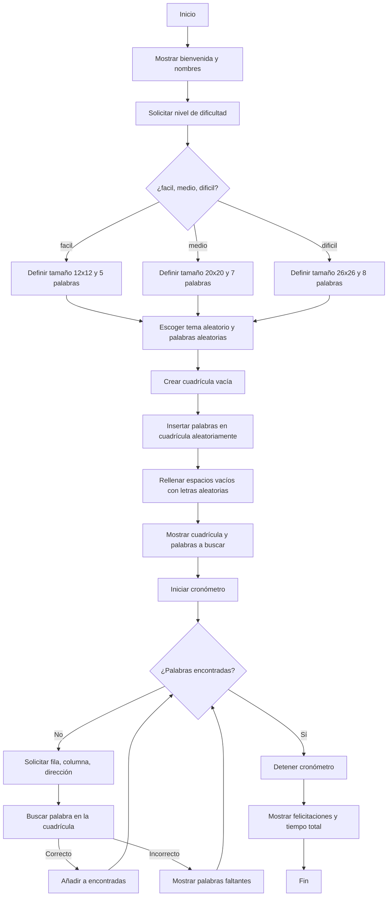

# PROYECTO FINAL PROGRAMACION DE COMPUTADORES
## Grupo: ConcreteByte
## Integrantes: Alejandro Merchan, Brandon Barriga
# SOPA DE LETRAS

En el desarrollo de este proyecto, se planteó como objetivo principal la creación de una sopa de letras interactiva mediante el lenguaje de programación Python, la cual permitiera al usuario seleccionar la dificultad y buscar palabras ocultas relacionadas con un tema específico. El propósito fue no solo desarrollar una herramienta lúdica, sino también reforzar conceptos fundamentales de programación.

Durante la etapa de planeación, se contemplaron varias alternativas para la implementación del juego. Entre las ideas iniciales, se pensó en desarrollar un menú que permitiera al usuario elegir el tema manualmente, así como implementar una cuadrícula con posiciones de palabras diagonales o incluso palabras escritas al revés. Sin embargo, tras analizar la complejidad y el tiempo disponible para la entrega, se decidió enfocar la solución en una sopa de letras más sencilla, donde las palabras se ubican únicamente de forma horizontal o vertical y son seleccionadas de forma aleatoria tanto en su posición como en su dirección.
Finalmente, se optamos por automatizar la elección del tema para darle un toque más dinámico al juego, dejando que el propio programa escoja entre los temas en el diccionario. Asimismo, se ofrecieron tres niveles de dificultad, variando tanto el tamaño de la cuadrícula como la cantidad de palabras a encontrar por el usuario.

## Planteamiento para la creación:

El desarrollo de la sopa de letras requirió organizar el proceso en pasos claros para garantizar que las palabras se ubicaran correctamente antes de rellenar la cuadrícula. Se diseñó un flujo que primero configura la dificultad, selecciona un tema y posiciona las palabras, y solo después completa los espacios restantes con letras aleatorias. Esto asegura que el juego funcione sin errores y mantenga la lógica del reto para el usuario.

### Diagrama de Flujo:
El siguiente diagrama de flujo muestra la lógica general que sigue el programa para generar y ejecutar la sopa de letras interactiva.

En el diagrama de flujo vemos la cuadricula que dice iniciar y detener cronometro, esto no es exactamente como un cronometro, lo que hace que podamos obetener el tiempo que tarda la persona en encontrar las palabras, es la libreria que importamos al principio (time), que tiene el tiempo en segundos que ha pasado desde una fecha de 1970 hasta el dia de hoy y va corriendo el tiempo hasta que se termine el juego.

TI= tiempo desde 1970 hata el inicio del juego

TF= tiempo desde 1970 hasta que se finalizo el juego

Cronometro= TF - TI

## Objetivo General:

Desarrollar una aplicación interactiva en Python que permita al usuario jugar una sopa de letras temática, fortaleciendo así las habilidades adquiridas durante el curso de programación de computadores, mediante la implementación de estructuras de datos, ciclos, condicionales y manejo de cadenas.

## Objetivos Específicos:

1. Diseñar un código que permita generar de manera aleatoria una cuadrícula con palabras ocultas relacionadas con un tema específico.
2. Implementar la funcionalidad para que el usuario pueda seleccionar el nivel de dificultad, ajustando el tamaño de la cuadrícula y la cantidad de palabras para encontrar.
3. Utilizar estructuras de datos como listas y diccionarios para organizar las palabras según las temáticas.
4. Aplicar la librería random para la selección aleatoria de palabras, posiciones y direcciones dentro de la cuadrícula.
5. Permitir la interacción con el usuario mediante la recolección de datos por consola para ubicar las palabras dentro de la sopa.
6. Medir el tiempo que tarda el usuario en completar el reto como parte de la retroalimentación del juego.

## Conlusiones:

El desarrollo de esta sopa de letras interactiva nos permitió afianzar los conocimientos fundamentales de la programación que aprendimos durante el curso, especialmente en la manipulación de listas, diccionarios y cadenas, así como en el manejo de ciclos, condicionales y funciones en Python. A través de este proyecto se demostró la importancia de organizar correctamente los datos y de implementar estructuras lógicas que faciliten la interacción con el usuario.

Aunque inicialmente se exploraron ideas más complejas, como permitir palabras en diagonal o elegir manualmente el tema, optamos por una solución que equilibrara funcionalidad, tiempo de desarrollo y claridad en la implementación. Gracias a esto, se logró construir un programa completamente funcional, capaz de generar sopas de letras temáticas con distintos niveles de dificultad y una experiencia dinámica para el usuario.

