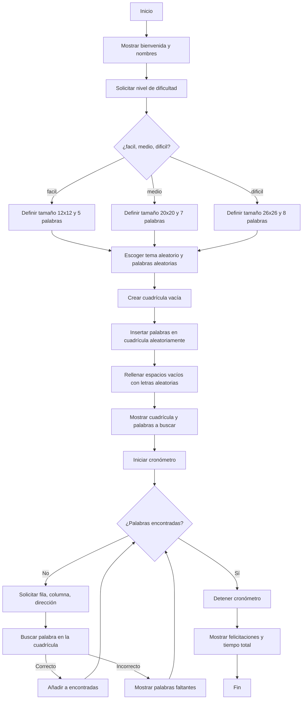

# PROYECTO FINAL PROGRAMACION DE COMPUTADORES
## Grupo: ConcreteByte
## Integrantes: Alejandro Merchan, Brandon Barriga
# SOPA DE LETRAS

En el desarrollo de este proyecto, se planteó como objetivo principal la creación de una sopa de letras interactiva mediante el lenguaje de programación Python, la cual permitiera al usuario seleccionar la dificultad y buscar palabras ocultas relacionadas con un tema específico. El propósito fue no solo desarrollar una herramienta lúdica, sino también reforzar conceptos fundamentales de programación.

Durante la etapa de planeación, se contemplaron varias alternativas para la implementación del juego. Entre las ideas iniciales, se pensó en desarrollar un menú que permitiera al usuario elegir el tema manualmente, así como implementar una cuadrícula con posiciones de palabras diagonales o incluso palabras escritas al revés. Sin embargo, tras analizar la complejidad y el tiempo disponible para la entrega, se decidió enfocar la solución en una sopa de letras más sencilla, donde las palabras se ubican únicamente de forma horizontal o vertical y son seleccionadas de forma aleatoria tanto en su posición como en su dirección.
Finalmente, se optamos por automatizar la elección del tema para darle un toque más dinámico al juego, dejando que el propio programa escoja entre los temas en el diccionario. Asimismo, se ofrecieron tres niveles de dificultad, variando tanto el tamaño de la cuadrícula como la cantidad de palabras a encontrar por el usuario.

## Planteamiento para la creación:

El desarrollo de la sopa de letras requirió organizar el proceso en pasos claros para garantizar que las palabras se ubicaran correctamente antes de rellenar la cuadrícula. Se diseñó un flujo que primero configura la dificultad, selecciona un tema y posiciona las palabras, y solo después completa los espacios restantes con letras aleatorias. Esto asegura que el juego funcione sin errores y mantenga la lógica del reto para el usuario.

### Diagrama de Flujo:
El siguiente diagrama de flujo muestra la lógica general que sigue el programa para generar y ejecutar la sopa de letras interactiva.

En el diagrama de flujo vemos la cuadricula que dice iniciar y detener cronometro, esto no es exactamente como un cronometro, lo que hace que podamos obetener el tiempo que tarda la persona en encontrar las palabras, es la libreria que importamos al principio (time), que tiene el tiempo en segundos que ha pasado desde una fecha de 1970 hasta el dia de hoy y va corriendo el tiempo hasta que se termine el juego.

TI= tiempo desde 1970 hata el inicio del juego

TF= tiempo desde 1970 hasta que se finalizo el juego

Cronometro= TF - TI

## Objetivo General:

Desarrollar una aplicación interactiva en Python que permita al usuario jugar una sopa de letras temática, fortaleciendo así las habilidades adquiridas durante el curso de programación de computadores, mediante la implementación de estructuras de datos, ciclos, condicionales y manejo de cadenas.

## Objetivos Específicos:

1. Diseñar un código que permita generar de manera aleatoria una cuadrícula con palabras ocultas relacionadas con un tema específico.
2. Implementar la funcionalidad para que el usuario pueda seleccionar el nivel de dificultad, ajustando el tamaño de la cuadrícula y la cantidad de palabras para encontrar.
3. Utilizar estructuras de datos como listas y diccionarios para organizar las palabras según las temáticas.
4. Aplicar la librería random para la selección aleatoria de palabras, posiciones y direcciones dentro de la cuadrícula.
5. Permitir la interacción con el usuario mediante la recolección de datos por consola para ubicar las palabras dentro de la sopa.
6. Medir el tiempo que tarda el usuario en completar el reto como parte de la retroalimentación del juego.

## ¿Cómo fue el proceso?
Antes de comenzar la codificación, se realizaron unos bocetos de diagrama de flujo con el fin de planear la lógica del juego. Estos diagramas sirvieron como guía para identificar los pasos clave del programa, como la generación de la cuadrícula, la inserción de palabras, la interacción con el usuario y la validación de los aciertos. Esto permitió visualizar el flujo general del programa, anticipar posibles errores y organizar mejor las estructuras de control que se usarían más adelante. Aunque no se hicieron diagramas perfectos ni exhaustivos, sí fueron muy útiles como esquema inicial para tener claridad sobre cómo se desarrollaría el código y muy importante, como iba a ser la experiencia de juego del usuario.

El desarrollo de la sopa de letras fue un proceso gradual que comenzó con una estructura sencilla: una cuadrícula de letras aleatorias y una lista de palabras por encontrar. Inicialmente trabajamos en cómo mostrar esa cuadrícula y cómo generar palabras en distintas direcciones sin salirse de los bordes. Para eso fue necesario crear condiciones específicas según cada dirección (horizontal, vertical y diagonal), y se usaron bucles for junto con validaciones para evitar errores al insertar o buscar palabras.

Una vez que la inserción funcionaba, nos concentramos en la interacción con el usuario. Se programó un sistema donde se ingresan coordenadas iniciales y una dirección para buscar palabras. Aquí surgieron varios desafíos, como validar los datos ingresados, verificar que no se salieran de la matriz y, en caso de error, permitir que el usuario intente de nuevo sin que el programa se cierre. Para eso se usaron while y estructuras de control que mantienen el flujo del juego constante y comprensible.

También se agregó una lista de palabras encontradas, que se va actualizando a medida que el jugador acierta. El juego muestra mensajes personalizados según el resultado de cada intento y mantiene visible el progreso en la cuadrícula. Finalmente, se incluyó una medición del tiempo en que se completa el juego, convirtiéndolo a minutos y segundos. Todo se desarrolló sin librerías externas, priorizando la claridad del código, el aprendizaje y una experiencia amigable.

 ## ¿Qué se obtuvo?
 **Acá se explica los distintos bloques utilizados, pero adjunto al repo se encuentra el archivo con el código, allí también se indica el titulo del bloque.
 
### Configurar dificultad
Aca se pregunta al usuario que dificultad quiere, eso definirá el tamaño y palabras a encontrar, se hace en un while para que en caso de ingresar algo raro, se le indique y vuelva a preguntar.

### Seleccionar palabras
Tenemos la biblioteca con los temas, (claves), el .key solo selecciona los temas. i los convierte en una lista con list(), luego random.choice selecciona uno de esos y los guarda en TEMA.
Tenemos el diccionario palabras, y con [] seleccionamos la clave que en este caso es la seleccionada aleatoriamente, junto con la variable cantidad que anteriormente se determinó según la dificultad. Random.sample selecciona CANTIDAD de palabras de esa lista.

### Crear cuadrícula vacía
Aca es simple, se crea una cuadricula vacía inicial, pasamos por x cantidad de filas (se crea una lista para crear la fila) y por cada fila pasamos x cantidad de columnas y le agregamos un espacio a la lista de fila.

### Insertar las palabras
Acá creamos una función que recibirá las palabras seleccionadas anteriormente, y creamos dos variables, una que determinará si es horizontal o vertical, esto con la herramienta antes mencionada. Otra variable con el largo de la palabra, esto para simplificar más adelante el bloque.
Luego, definimos cuatro casos casos, si es horizontal o vertical o las mismas pero al revés, en todos los casos, definimos con la función .randint dos valores para que se escoja uno aleatoriamente en ese rango, en este caso como es horizontal sería del 0 al tamaño de la cuadrícula menos uno, esto porque si son 10 filas, sería del 0 al 9, no del 0 al 10.
Para columnas, como es horizontal la palabra, tenemos que procurar que la palabra no se va a salir, por eso reducimos el rango de 0 al tamaño menos el largo de la palabra seleccionada.
Luego, se va a revisar la posición, y si lo que hay ahí es distinto de vacío o la misma palabra va a cambiar todo chill por false y se perderá ese intento(porque muy seguramente choca con otra palabra que se insertó, saltará nuevamente al ciclo con los 100 intentos.
En caso de que en esa posición esté vacío o la misma palabra se seguirá el bloque y se añadirá la palabra.
En este caso, si la palabra es vertical, ya que algunos parámetros cambian, se eligió la columna de 0 a tam-1, y la fila será desde 0 hasta el largo de la palabra.
Finalmente, se pasa por cada palabra de la lista y se aplica la función a cada una de insertar, hay 400 intentos para cada palabra de insertarse.

### Relleno
Aca se pasa por cada celda, y si es igual a espacio, se eligió una letra del abecedario y se le pondrá dentro.

### Imprimir cuadrícula
Aca se imprimirá cada fila de la matriz, pero se utiliza el “ “.join para unir la fila y que se separen por “ “, pues si no, imprimirá la lista completa como, [a,v,s,h,d,v] en vez de z a g a t b s.

### Inicio del juego
Se crea una lista para guardar las palabras que vaya encontrando el jugador, se crea una variable con el la función time.time, la cual nos da el valor exacto de segundos que han pasado desde 1970 1 de enero 00:00 en ese instante.
Imprimimos las instrucciones y las palabras a encontrar.

### Bucle del juego
Acá creamos un bucle con while mientras no se encuentren todas las palabras. Acá se evalúa la dirección y si ingresa finalizar, y con break se acaba el while.
Acá lo que se hace es crear un string vacío donde vamos a ir agregando las letras. Dependiendo de las instrucciones dadas arriba, se guardaron las variables de las coordenadas dadas por el jugador. Acá validamos si se sale de la cuadricula o si no es válido.
Finalmente, creamos otra variable de time.time para ver los segundos en el momento de la finalización y restamos ambos tiempos en una variable para ver el tiempo demorado.

## Resultado final
Obtuvimos un programa interactivo de python, con contador de tiempo, tamaño y palabras a encontrar según dificultas, el jugador puede finalizar cuando desee.

## Conlusiones:

El desarrollo de esta sopa de letras interactiva nos permitió afianzar los conocimientos fundamentales de la programación que aprendimos durante el curso, especialmente en la manipulación de listas, diccionarios y cadenas, así como en el manejo de ciclos, condicionales y funciones en Python. A través de este proyecto se demostró la importancia de organizar correctamente los datos y de implementar estructuras lógicas que faciliten la interacción con el usuario.

Aunque inicialmente se exploraron ideas más complejas, como permitir palabras en diagonal o elegir manualmente el tema, optamos por una solución que equilibrara funcionalidad, tiempo de desarrollo y claridad en la implementación. Gracias a esto, se logró construir un programa completamente funcional, capaz de generar sopas de letras temáticas con distintos niveles de dificultad y una experiencia dinámica para el usuario.

